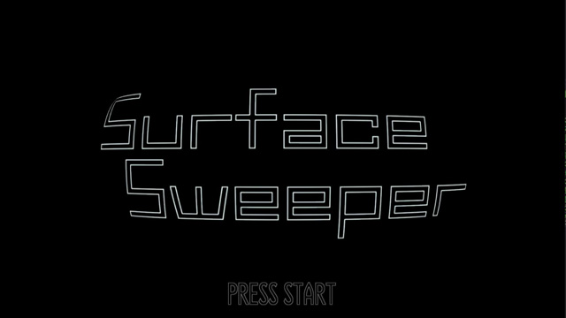
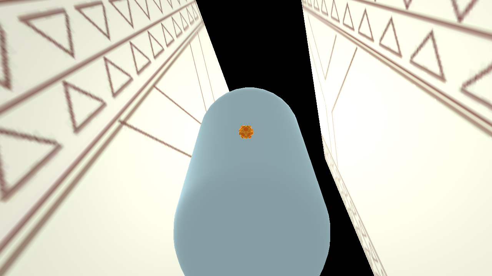
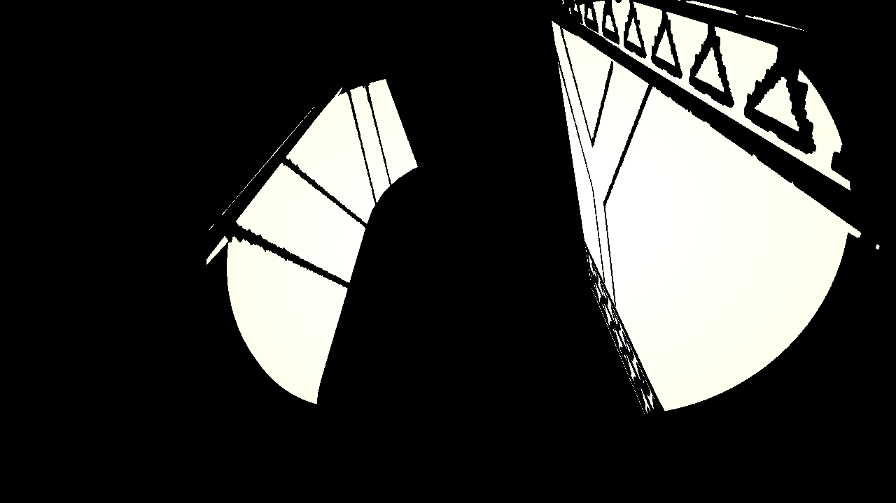
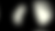
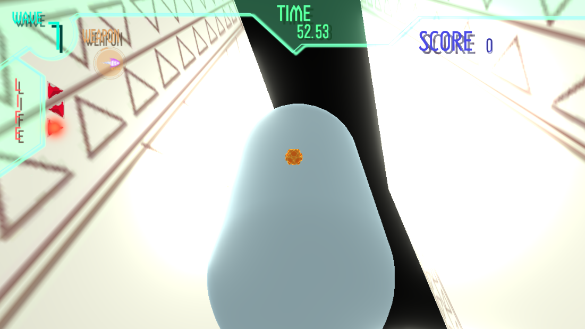
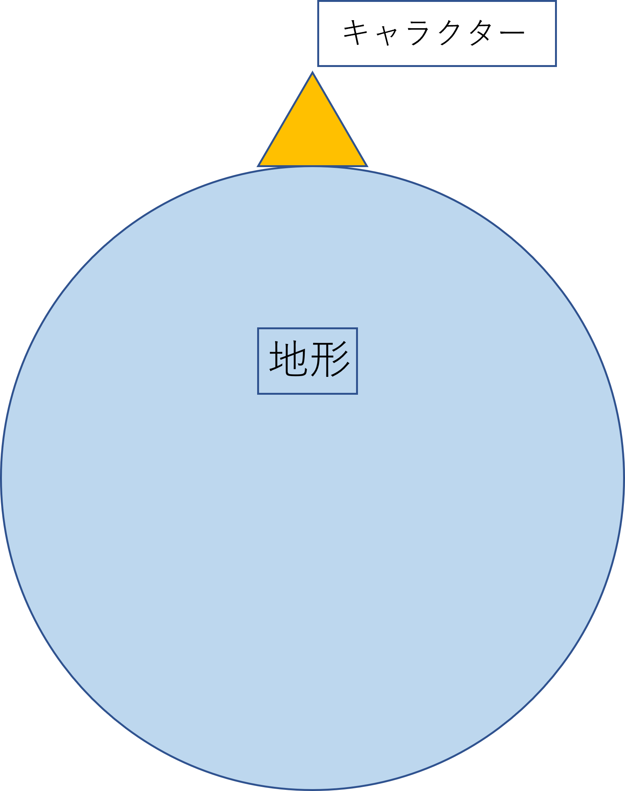
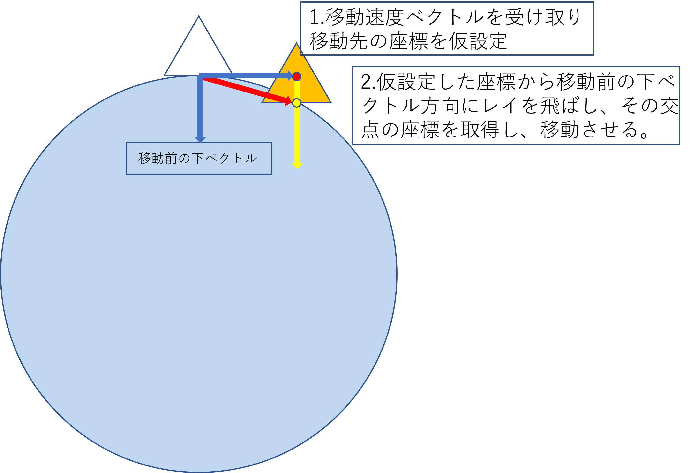
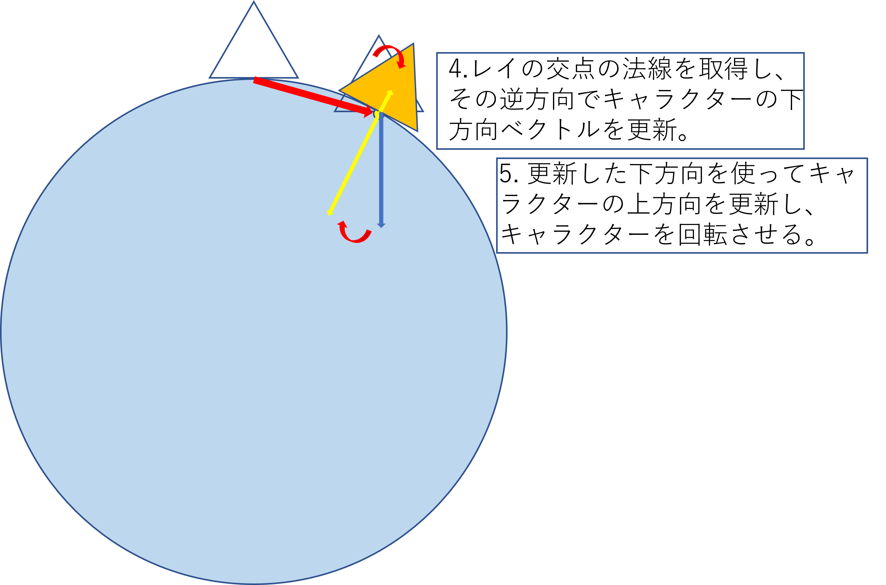
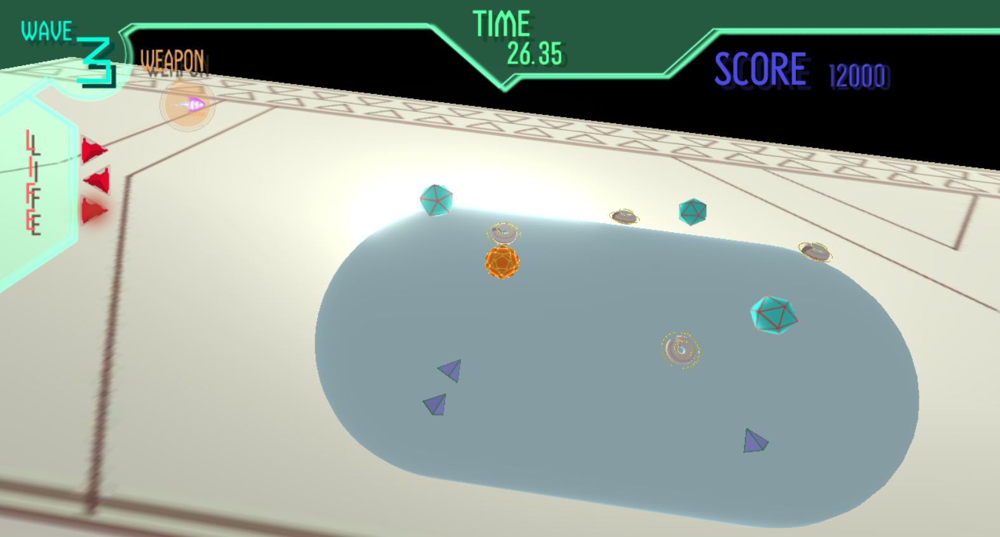

## 河原電子ビジネス専門学校
## ゲームクリエイター科　　2年　　越智　翔平
##### _____________________________________________________________________

## **目次**

1. 概要
1. 操作方法
1. 担当ソースコード
1. 技術解説
    1. 川瀬式ブルーム
    1. 球面移動 
2. こだわり、工夫した点

### 1.概要
##### ______________________________________________

- 作品名:SURFACE SWEEPER

- 使用ゲームエンジン:学内ゲームエンジン
- 使用言語:C++
- 開発環境:VisualStudio 2019
- 使用ツール:3dsMax,Effekseer
- 使用ライブラリ:DirectXTK12,BulletPhysics,Effekseer
- 制作人数:1人
- 制作期間:5ヵ月
- Github:https://github.com/kw11SL/miniEngine

### 2.操作方法
##### ______________________________________________
- スタートボタン:タイトルからインゲームへの遷移
- Aボタン:リザルト画面からタイトルへの遷移
- 左スティック:自機の移動
- 右スティック:発射方向の変更
- 右トリガー1:弾の発射(右スティックを倒した方向に発射)
- 左トリガー1:使用する弾の切り替え

### 3.担当ソースコード
##### ______________________________________________

#####エンジン部分
- RenderingEngine.cpp
- RenderingEngine.h
- SkinModelRender.cpp
- SkinModelRender.h
- SpriteRender.cpp
- SpriteRender.h
- ShadowMapRender.cpp
- ShadowMapRender.h
- FontRender.cpp
- FontRender.h
- DirectionLight.cpp
- DirectionLight.h
- PointLight.cpp
- PointLight.h
- SpotLight.cpp
- SpotLight.h
- Bloom.cpp
- Bloom.h
- GaussianBlur.cpp
- GaussianBlur.h
- MyCharacterController.cpp
- MyCharacterController.h
- SphericalMove.cpp
- SphericalMove.h

##### ゲーム部分
- main.cpp
- GameDirector.cpp
- GameDirector.h
- Game.cpp
- Game.h
- GameCamera.cpp
- GameCamera.h
- Player_new.cpp
- Player_new.h
- Bullet.cpp
- Bullet.h
- BulletManager.cpp
- BulletManager.h
- Enemy.cpp
- Enemy.h
- EnemyGenerator.cpp
- EnemyGenerator.h
- ExplosionBase.cpp
- ExplosionBase.h
- SpreadBombExplosion.cpp
- SpreadBombExplosion.h
- EnemyExplosion.cpp
- EnemyExplosion.h
- Explosion.cpp
- Explosion.h
- BG.cpp
- BG.h
- StageBackGround.cpp
- StageBackGround.h
- Title.cpp
- Title.h
- TitleSprite.cpp
- TitleSprite.h
- PressStart.cpp
- PressStart.h
- UI.cpp
- UI.h
- UIOutline.cpp
- UIOutline.h
- Score.cpp
- Score.h
- Timer.cpp
- Timer.h
- Life.cpp
- Life.h
- Wave.cpp
- Wave.h
- WeaponIcon.cpp
- WeaponIcon.h
- WaveCutIn.cpp
- WaveCutIn.h
- WaveCutIn.cpp
- WaveCutIn.h
- Result.cpp
- Result.h
- GameOver.cpp
- GameOver.h
- stdafx.h

### 4.技術解説
##### _____________________________________________________________________

#### 1.川瀬式ブルーム
現実世界で、ある物体に対して強い光が当たる、もしくは物体自身が強い光を放っている場合、光が溢れだす現象が起きる。
このような現象をブルームという。本ゲームではこの現象を再現し、より綺麗に見せるため、
既存のブルームのアルゴリズムを改良したものである川瀬式ブルームと呼ばれるものを実装している。

川瀬式ブルームとは、かつてぶんか社に所属していた川瀬正樹氏が2003年のGDC(Game Developers Conference)で発表したブルームフィルタの手法である。

まず、一般的なブルームでは、
1. シーンをレンダーターゲットにレンダリング
1. レンダーターゲットからシーンの輝度を輝度テクスチャとして抽出する。
1. 抽出した輝度テクスチャにガウシアンブラーを掛けてぼかす
1. ぼかした輝度テクスチャをレンダーターゲットに加算合成する
といった手順で行われる。

川瀬式ブルームでは、上記3のときに
- 抽出した輝度テクスチャを基にガウシアンブラーを掛ける。
- ダウンサンプリング(縮小)を行う。
- ダウンサンプリングされたテクスチャを元に再度ブラー処理と縮小処理を行う。

という処理を複数回繰り返し、最終的にダウンサンプリングされた複数のテクスチャをシーンの解像度に引き延ばして加算合成を行うことで一般的なブルーム処理より綺麗なブルーム処理を実現するというものである。
以下の画像はRenderDocでキャプチャしたブルーム処理中の様子である。
本ゲーム内ではブラーと縮小の処理を4回行っている
  

  
左上:元のシーン　右上:輝度抽出テクスチャ　左下:ブラーと縮小1回目　右下:ブラーと縮小2回目

  

 
左上:ブラーと縮小3回目　右上:ブラーと縮小4回目　左下:シーンに最終合成

#### 3.球面移動
本ゲームではキャラクターや自機弾がステージの地形に沿って動くようになっている。
 
図の状態からキャラクターを右方向に移動させるとする。

 
キャラクターが右方向に移動すると、移動先の座標を仮設定する。仮決定した座標から下ベクトル方向にレイを飛ばし、地形との交点の座標を取得し、キャラクターをその座標に移動させる。

 
移動後、レイの交点の地形の法線を取得し、法線の逆方向をキャラクターの下方向ベクトルとして更新する。その後、更新した下方向ベクトルの逆方向をキャラクターの上方向ベクトルとして更新し、キャラクターの回転を行うことで、地形に沿った移動ができるようになっている。

### 5.こだわり、工夫した点
##### _____________________________________________________________________
### UI

 
本ゲーム中のUI素材はPhotoshopElementsを使用して製作している。
配置の工夫として、画面の上部だけを見れば全ての情報が分かるように配置を行っている。
デザインとしては、直線的で無機的な造形に加え、半透明部分を作ったり、青緑系統の色を使用することでHUDのような見た目をイメージしている。 

   

また、上の図のように文字部分の色とアイコンや数字のイメージカラーを統一することで、表示物を見たときに認識しやすくなるよう心掛けた。

### エフェクト
本ゲーム内のエフェクトはEffekseerを使用して製作している。

エフェクトを製作するにあたり心掛けたこととして『余韻』がある。 

 

 

たとえば、上の画像はエネミーが撃破されたときに発生する爆発エフェクトの時間経過を切り取ったものであり、左上　→　右上　→　左下　→　右下の順でエフェクトが再生される。

- メインになる明るい部分とパーティクルが発生。
- 明るい部分が徐々に拡大していく。
- 衝撃波となるリングが発生
- 明るい部分がフェードアウトしたあとにリングとパーティクルが拡散していく。

といった構成になっている。メインとなる明るい部分が消えたあとも、衝撃波やパーティクルでやや余韻を残すことによって「敵を撃破した」という感覚が心地よいものになるように心掛けた。